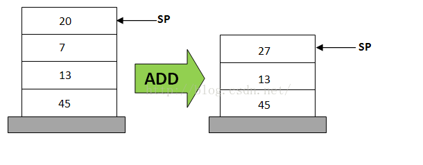
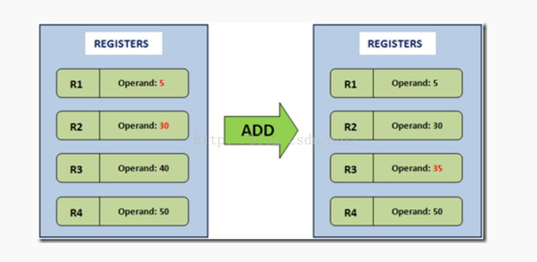
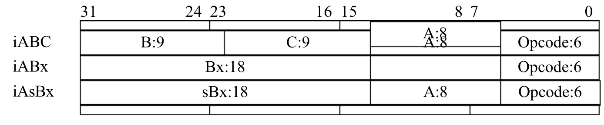

# DiceyLua 文档

## Lua 虚拟机及 API

**第一步自然是要分析 Lua 的数据结构啦**

类似于 Java，也是先编译成字节码，再由解释器（Lua 虚拟机）解释运行

Lua 的字节码载体（类似于 Java 的 class 文件）为二进制 chunk， 内部还有常量池 行号表等

但是与 Java 不同，Lua 解释器是在内部进行编译，不像 Java 一样会出现显式的 class 文件，这也使得预编译并不会加快脚本执行速度，但会加快脚本的加载速度，一定程度上加快了脚本加载速度

将 Lua 源码编译成 chunk 的工具是 luac

### 二进制 Chunk

Lua 编译器以函数为单位进行编译,每一个函数都会被 Lua 编译器编译为一个内部结构, 即原型(Prototype)

原型主要包含六部分内容:

- 函数基本信息(参数变量 局部变量数量等)

- 字节码

- 常量表

- Upvalue 表

  如果函数f2定义在函数f1中，那么f2为f1的内嵌函数，f1为f2的外包函数，外包和内嵌都具有传递性，即f2的内嵌必然是f1的内嵌，而f1的外包也一定是f2的外包。

  内嵌函数可以访问外包函数已经创建的局部变量，而这些局部变量则称为该内嵌函数的外部局部变量（或upvalue）

- 调试信息

- 子函数原型列表

#### 数据类型

二进制 chunk 本质上来说是一个字节流, 我们需要将其编码为一个或多个字节的信息单位,即得到数据类型

数据类型有三种

- 数字

  在 chunk 中按照固定长度存储.其对应 go 语言类型以及占用字节如下表

  - 字节: 存放一些比较小的整数值,如 Lua 版本号,函数的参数个数等.
  - C 语言整型:主要用来表示列表长度
  - C 语言 size_t:主要用来表示字符串长度
  - Lua 整数:常量表
  - Lua 浮点数: 常量表

  | 数据类型      | Go 语言类型 | 占用字节 |
  | ------------- | ----------- | -------- |
  | 字节          | byte        | 1        |
  | C 语言整型    | uint32      | 4        |
  | C 语言 size_t | uint64      | 8        |
  | Lua 整型      | int64       | 8        |
  | Lua 浮点型    | float64     | 8        |

- 字符串

  本质上是一个字节数组, 还需记录下字节数组的长度, 还可以分为短字符串和长字符串两种

  - NULL 字符串, 0x00 来表示
  - 长度小于等于 253 (0xFD), 先使用一个字节记录长度+1,然后是字节数组
  - 长度大于等于 254 (0xFE), 第一个字节是 0xFF ,后面跟一个 size_t 记录长度+1,最后是字节数组

- 列表

  指令表,常量表,子函数原型表等信息都是按照列表的方式存储的. 先是一个 cint 记录列表长度,紧接着存储 n 个列表元素

#### 头部结构

- 签名: 即魔数, 为 ESC L u a 的 ASCII 码, 即0x1B4C7561, 写成 Go 语言字符串字面量是"\x1bLua"
- 版本号: 实际上是大版本乘 16 再加小版本, 例如5.3.4版本实际存储结果为 5x16 + 3 = 83,存为 16 进制为0 x53
- 格式号: 二进制 chunk 的格式号, 检查是否与虚拟机匹配
- LUAC_DATA: 也是一组魔数, 校验用
- 整数和 Lua 虚拟机指令宽度: 检测上面所提到的数字类型其占用字节是否与预期一致
- LUAC_INT: 使用 n 个字节固定存放 0x5678, 这里的 n 为上条所提到**整数指令宽度**. 使用该数字校验大小端
- LUAC_NUM: 使用 n 个字节存放370.5. 为了检验浮点数格式,一般为 IEEE 754格式

#### 函数原型

见上二进制 Chunk 部分

- 源文件名: 记录二进制 chunk 是由哪个源文件编译出来的.即文件来源
- 起止行号: 两个 cint. 主函数的值为 0
- 固定参数个数
- 是否是 Vararg 函数
- 寄存器数量: Lua 虚拟机是基于寄存器的虚拟机, 大部分指令也都会涉及虚拟寄存器的操作, 因此需要记录数量
- 指令表: 每条指令 4 字节
- 常量表: 包括 nil 布尔 整数 浮点数 字符串 五种. 其分别有对应 tag
- Upvalue 表
- 子函数原型: 没有子函数时为 0
- 行号表: 行号与指令表中的指令一一对应
- 局部变量表: 每个元素都包含变量名和起止指令索引 
- Upvalue 名列表: 其中元素与 Upvalue 表中的一一对应

### 指令集

#### 指令集概念

高级语言的虚拟机是对真实计算机的模拟和抽象, 
一个虚拟机在理想情况下应该有如下概念:

- 将源码编译成VM指定的字节码。
- 包含指令和操作数的数据结构(指令用于处理操作数作何种运算)
- 一个为所有函数操作的调用栈。
- 一个"指令指针 (Instruction Point ---IP)": 用于指向下一条将要执行的指令
- 一个虚拟的"CPU"--指令的派发者(只到三级流水线操作)：
  - 取指：获取下一条指令（通过IP获取）
  - 译码：对指令进行翻译，将要作何种操作
  - 执行：执行指令

主要有两种实现方式

- 基于栈的虚拟机

  如 Java, .Net, Python 虚拟机

  一个基于 Stack 的虚拟机会通过IP来获取操作数，其操作数都是保存在Stack数据结构中，从栈中取出数据、计算然后再将结果存入栈中

  因为需要 PUSH 类指令往栈顶推入值,POP 类命令来出栈,其他指令来操作栈顶元素. 因此指令集相对较大但是单条指令平均长度较短

- 基于寄存器的虚拟机

  如安卓的 Dalvik 和 Lua

  基于寄存器的虚拟机，它们的操作数是存放在CPU的寄存器的。没有入栈和出栈的操作和概念。但是执行的指令就需要**包含操作数的地址**了，也就是说，**指令必须明确的包含操作数的地址**，这不像栈可以用栈指针去操作

  因为需要记录操作数地址但是不需要 PUSH 和 POP 类命令, 所以指令集较小但是单条指令较长

> **栈虚拟机的加法操作**
>
> 
>
> 20 + 7 的计算过程为
>
> 1. POP 20
> 2. POP 7
> 3. ADD 20, 7, result
> 4. PUSH result
>
> **基于寄存器的虚拟机的加法操作**
>
> 
>
> ADD R1, R2, R3 只需要一条指令

> 基于寄存器的VM没有入栈和出栈的操作。所以加法指令只需要一行就够了，但是不像Stack-Based一样，我们**需要明确的制定操作数R1、R2、R3（这些都是寄存器）的地址**。这种设计的有点就是去掉了入栈和出栈的操作，并且指令在寄存器虚拟机**执行得更快**
> 基于寄存器得虚拟机还有一个优点就是一些在基于Stack的虚拟机中无法实现的优化，比如，在**代码中有一些相同的减法表达式，那么寄存器只需要计算一次，然后将结果保存**，如果之后还有这种表达式需要计算就直接返回结果。这样就减少了重复计算所造成的开销。
> 当然，寄存器虚拟机也有一些问题，比如虚拟机的**指令比Stack vm指令要长**（因为Register指令包含了操作数地址）

指令集还分为定长和变长两种

- 变长: 如 Java.指令长度从 1 到 N 不等
- 定长: 如 Lua 每条指令占 4 字节(32bit).6bit 为操作码,25 比特用于操作数

##### Lua 的指令种类

- 常量加载指令
- 运算符相关指令
- 循环和跳转指令
- 函数调用相关指令
- 表操作指令
- Upvalue 指令

#### 编码格式

共四种模式

- iABC: 可以携带 A(8bit), B(9bit), C(9bit) 三个**操作数**
- iABx: 可以携带 A 和 Bx 两个操作数, 分别占用 8 和 18 个比特
- iAsBx: 可以携带 A 和 sBx 两个操作数, 分别占用 8 和 18 个比特. 其中 sBx 会被解析为无符号整数
- iAx: 只携带一个操作数, 占全部 26 比特



#### 操作数

每条指令可携带 1 到 3 个操作数.
其中操作数 A 主要用来表示目标寄存器索引,  其他擦作数可以粗略分为四种类型

- OpArgN(Argument is not used)

  - 操作数不会被使用

- OpArgU(Argument is used): 立即数?

- OpArgR(Argument is register or a jump offset)

  - iABC下, 表示寄存器索引
  - iAsBx下,表示跳转偏移

- OpArgK(Argument is a constant or register/constant)
  - 对于 LOADK 指令(iABx 模式, 用于将常量表中的常量加载到寄存器中): 该指令的 Bx 操作数表示常量表索引

  - 对于部分 iABC 指令: 这指令下的 B 和 C 操作数既可以表示**常量表索引**也可以表示**寄存器索引**

    至于如何区分该指令是常量表索引还是寄存器索引, 在 iABC 下每个操作数占 9bit, 但是对于 OpArgk 类型的操作数来说, 他们只能使用 **8bit**, 其最高位就是用来区分是常量表索引还是寄存器索引的
    **当高位比特为 1 是, 该操作数是常量表索引. 否则是寄存器索引**

#### 指令表

每一条指令的基本信息(编码模式, 是否设置寄存器 A, 操作数 B 和 C 的使用类型等)都编码成了一个字节

### Lua API

与其他语言不同 Lua 的 API 在很多时候是提供给其他语言来使用.

> Lua 的定位是**可嵌入脚本**语言, 所以为了很方便地嵌入到其他宿主环境中, Lua 核心是以库的形式被实现的, 其他应用程序只需要连接 Lua 库就可以使用 Lua 提供的 API 轻松获得脚本执行能力

Lua 的 API 主要是指一系列以"lua_"开头的 C 语言函数

最开始 Lua 解释器的状态是完全隐藏在 API 后面的, 散落在各种全局变量里.但是某些宿主环境需要同时使用多个 Lua 解释器实例.因此后来的 Lua 引入了 **Lua_State 结构体, **对多个 Lua 解释器进行了封装,使得用户可以在多个解释器之间来回切换

Lua4.0 引入了**虚拟栈**的概念, 使得 lua_State 对用户可见. 用户实际操作时使用 lua_newstate() 函数创建 lua_State 实例, 其他函数则操作该实例.

综上, **Lua_State 是 Lua API 的核心, 其本质上是一个非严格意义上的栈(可以使用索引直接访问其中元素). Lua_State 是宿主语言和 Lua 语言之间沟通的桥梁**

#### Lua 的数据类型

Lua 栈里存放的是 Lua 值. 作为一个动态类型语言, Lua 代码里变量是不携带类型信息的,**变量的值才携带信息**

以下为 Lua 类型的与 Go 语言类型的映射关系, 其中 Lua 的表(table), 线程(thread)和函数(function)类型要单独处理

| Lua 类型 | Go 类型 |
| -------- | ------- |
| nil      | nil     |
| boolean  | bool    |
| integer  | int64   |
| float    | float64 |
| string   | string  |

#### 栈索引

下标是从 1 开始而不是从 0 开始, 同时也可以是负数(具体实现是将负数自动转化为正数索引)

### 运算符

共 25 个

- 算数运算符:加减乘除, 整除, 取模, 乘方

  加减乘除取反都可以直接使用 Go 的运算符, 但是乘方运算符(无该运算符), 整除运算符(Lua 为向下取整, Go 为截断), 取模运算符(同上)无对应映射, 需要手动实现

- 按位运算符: 按位与, 按位或, 二元异或/一元取反, 左移, 右移

  所有的按位运算符都会将结果转化为整数再进行操作. 除了右移左移外, 其他操作可以直接映射 Go 的对应运算

- 比较运算符

#### 自动类型转换

在部分运算中存在的自动类型转换

- 算数运算符
  - 除法和乘方运算
    - 整数→浮点数
    - 字符串→浮点数
  - 其他
    - 整数能进行运算则使用整数
    - 否则转换为浮点数
- 按位运算符
  - 浮点数→整数
  - 字符串→整数
  - 字符串→浮点数→整数
- 字符串拼接
  - 数字→字符串

### 基础虚拟机

PC 寄存器, 用于装载需要执行的命令

```
loop{
	1. 计算 PC
	2. 取出当前指令
	3. 执行当前指令
}
```

> Lua 解释器在执行一段 Lua 脚本之前, 会先把它包在一个主函数里编译成 Lua 虚拟机指令序列, 然后联通其他的信息一起打包成一个二进制 chunk, 然后 Lua 虚拟机会接管二进制 chunk, 执行里面的指令.
>
> 所以虚拟机实际上是解析二进制 chunk 再执行

但是 Lua 虚拟机是基于寄存器的虚拟机, 所以 Lua 虚拟机指令中还需要大量涉及寄存器的操作. 而这些寄存器操作可以直接复用 Lua State 的 API, 部分仍然需要扩写

